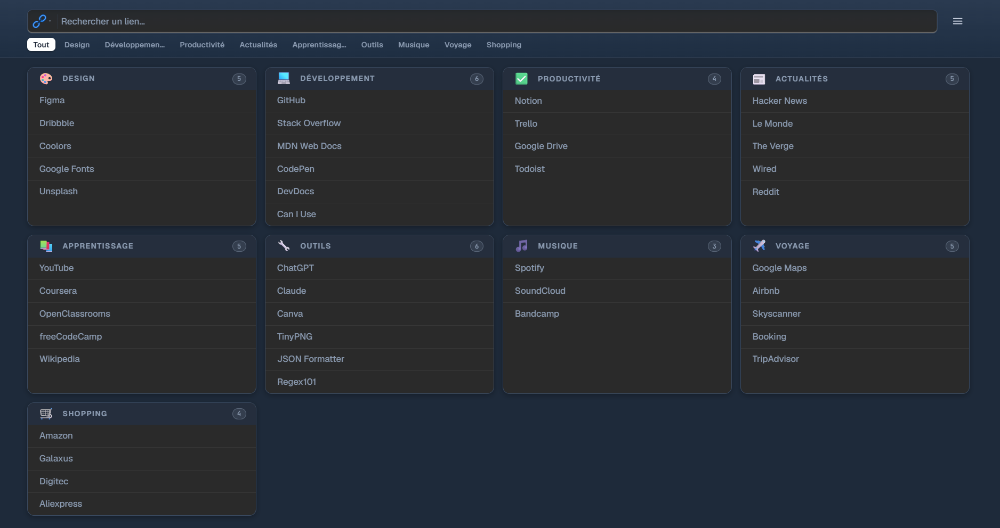
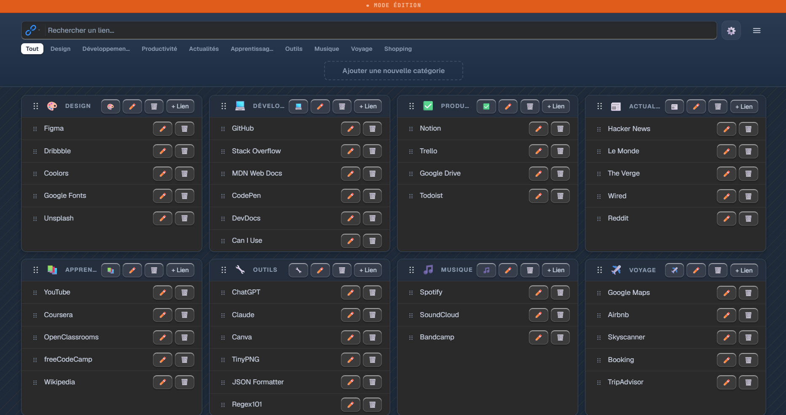
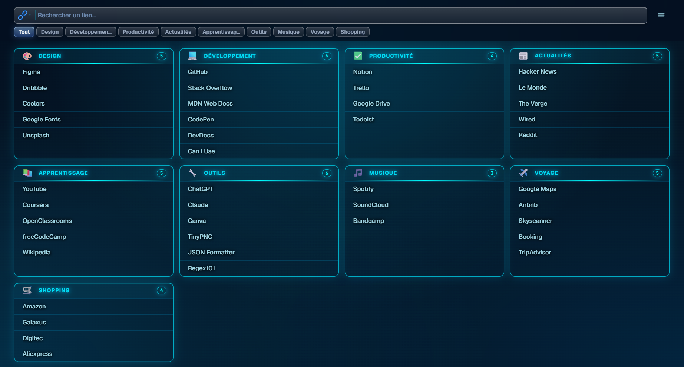

# 🔗 Mes Liens
> Gestionnaire de liens personnel — rapide, élégant, accessible partout.

  

---

## ✨ Présentation

**Mes Liens** est une application web accessible depuis n'importe quel appareil via une simple URL. Aucune installation, aucun serveur à gérer. Ouvrez le lien et c'est prêt.

Conçue pour centraliser en un seul endroit vos liens web, fichiers et dossiers locaux, ainsi que des raccourcis vers certaines applications (Teams, Outlook, Zoom, Slack…) — organisés par catégories et ouverts en un clic. Les exécutables (.exe) ne sont pas supportés.

---

## 📸 Aperçu





---

## 🚀 Fonctionnalités

- 📁 **Catégories personnalisables** — organisez vos liens par thème avec une couleur attribuée à chaque catégorie
- 🏷️ **Icônes de catégories** — associez une icône emoji à chaque catégorie pour une navigation plus visuelle
- 🔍 **Barre de recherche universelle** — recherchez parmi vos liens, sur Google, YouTube ou sur SharePoint
- 🎨 **8 thèmes visuels** — Clair, Sombre, Pastel, Nuit Étoilée, Aurore Boréale, Lavande, Glace, Minuit
- ✏️ **Mode édition** — ajoutez, modifiez, supprimez et réorganisez vos liens par glisser-déposer
- 🔗 **Raccourcis applications** — ouvrez rapidement Teams, Outlook, Zoom et d'autres apps depuis vos liens. Seules les applications listées ci-dessous sont supportées — les fichiers `.exe` ne peuvent pas être lancés directement
- 📂 **Liens vers fichiers locaux** — créez des raccourcis vers des fichiers ou dossiers de votre ordinateur (`C:/...`)
- 📱 **Compatible mobile** — interface adaptée avec boutons de navigation tactile en mode édition
- 💾 **Sauvegarde automatique** — chaque modification est instantanément enregistrée dans votre navigateur
- 📤 **Export / Import de données** — transférez vos liens entre appareils
- 📶 **Mode hors-ligne (PWA)** — l'application fonctionne sans internet après la première visite

---

## 📦 Installation

Aucune installation requise. Ouvrez simplement l'URL dans votre navigateur :

```
https://lifekits.github.io/mes-liens/
```

Pour un accès rapide, ajoutez-la à votre écran d'accueil :
- **iPhone** : Safari → icône Partager → "Sur l'écran d'accueil"
- **Android** : Chrome → menu ⋮ → "Ajouter à l'écran d'accueil"

---

## 🛠️ Utilisation

### Ajouter un lien
1. Activez le **mode édition** via le menu ☰
2. Cliquez sur **"Ajouter une nouvelle catégorie"** ou sur **"+ Lien"** dans une catégorie existante
3. Renseignez le nom et l'URL — vos modifications sont automatiquement sauvegardées

### Transférer ses liens sur un autre appareil

1. Sur l'appareil source — menu ☰ → **📤 Exporter les données** → enregistrez le fichier
2. Sur le nouvel appareil — ouvrez l'URL, menu ☰ → **📥 Importer les données** → sélectionnez le fichier

> Conseil : conservez ce fichier de données en lieu sûr comme sauvegarde.

### Barre de recherche

| Mode | Description |
|------|-------------|
| Mes liens | Filtre vos liens en temps réel |
| Google | Lance une recherche Google (Entrée) |
| YouTube | Lance une recherche YouTube (Entrée) |
| SharePoint | Lance une recherche sur votre SharePoint (Entrée) |

### Liens vers fichiers et dossiers locaux

Entrez simplement le chemin Windows dans le champ URL :

```
C:/Users/VotreNom/Documents/MonFichier.xlsx
C:/Users/VotreNom/Documents/MonDossier
```

Les fichiers Office (`.xlsx`, `.docx`, `.pptx`) s'ouvrent directement dans l'application correspondante.

### Ouvrir des applications directement

Tapez simplement le nom de l'application dans le champ URL :

| Ce que vous tapez | Application lancée |
|---|---|
| `teams` | Microsoft Teams |
| `outlook` | Microsoft Outlook |
| `excel` | Microsoft Excel |
| `word` | Microsoft Word |
| `powerpoint` | Microsoft PowerPoint |
| `onenote` | Microsoft OneNote |
| `zoom` | Zoom |
| `slack` | Slack |
| `skype` | Skype |
| `webex` | Cisco Webex |
| `notion` | Notion |
| `figma` | Figma |
| `vscode` | Visual Studio Code |
| `spotify` | Spotify |

> Ces raccourcis fonctionnent uniquement pour les applications listées ci-dessus, à condition qu'elles soient installées sur votre ordinateur. Il n'est pas possible de lancer d'autres applications ou fichiers `.exe` directement depuis Mes Liens.

---

## 🔄 Mise à jour

Lorsque vous ouvrez l'application, elle est toujours à jour automatiquement. Aucune action requise de votre côté.

---

## 📋 Prérequis

- Navigateur moderne : **Chrome**, **Edge**, **Safari** ou **Firefox**
- Connexion internet uniquement pour la première visite (ensuite fonctionne hors-ligne)

---

## 📄 Licence

Libre d'utilisation et de modification.
